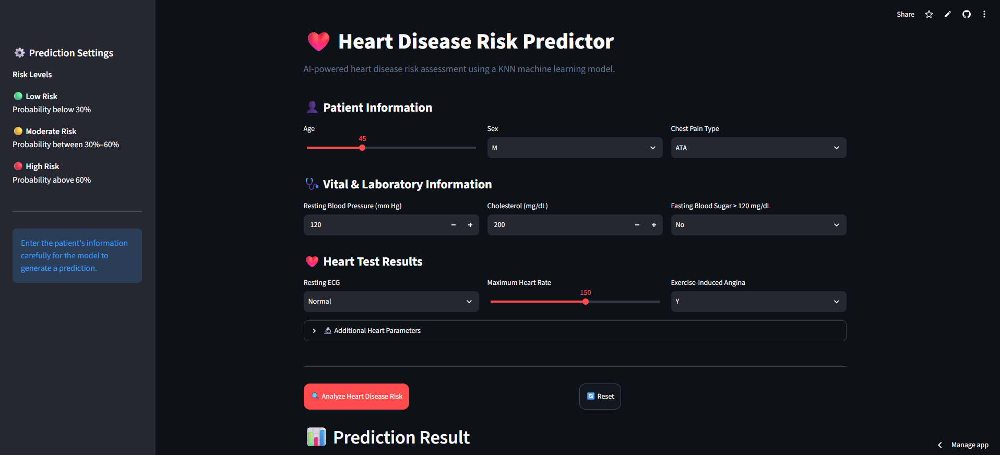
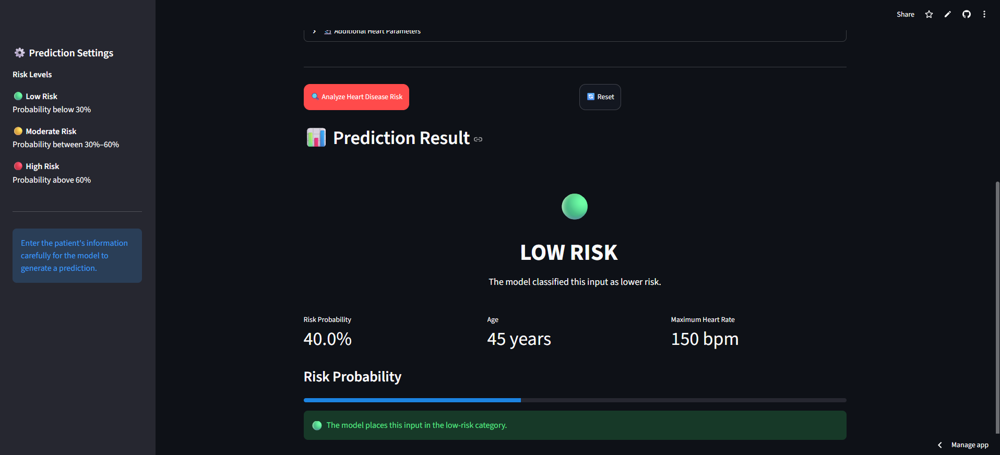
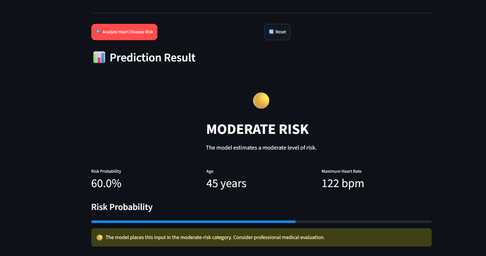
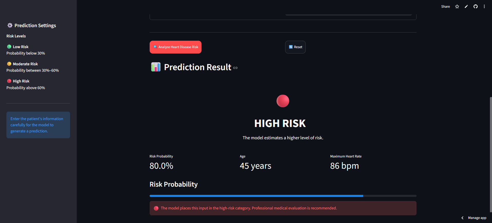

# ❤️ Heart Health Prediction

A Machine Learning-based application that predicts **heart disease risk** using important health and lifestyle factors. The project transforms patient-related data into an easy-to-understand risk prediction through an interactive **Streamlit** application.

🔗 **[Heart-Health-Prediction-Live-Project](https://heart-health-prediction-princebuildsai.streamlit.app/)**

---
## 🖼️ Project Preview

<table align="center">
  <tr>
    <td style="border: 2px solid #00aaff; border-radius: 12px; padding: 6px; box-shadow: 0 0 15px #00aaff;">
      
    </td>
    <td style="border: 2px solid #00aaff; border-radius: 12px; padding: 6px; box-shadow: 0 0 15px #00aaff;">
      
    </td>
  </tr>
  <tr>
    <td style="border: 2px solid #00aaff; border-radius: 12px; padding: 6px; box-shadow: 0 0 15px #00aaff;">
      
    </td>
    <td style="border: 2px solid #00aaff; border-radius: 12px; padding: 6px; box-shadow: 0 0 15px #00aaff;">
      
    </td>
  </tr>
</table>

## 🚀 Key Features

* ❤️ **Heart Disease Risk Prediction**
* 📊 **10,000+ healthcare records** used for model training
* 🤖 Machine Learning-based prediction system
* 🎯 Uses multiple health and lifestyle factors
* 🌐 Interactive Streamlit web application
* ⚡ Fast and easy real-time predictions
* 📈 Data preprocessing and model evaluation

---

## 📊 Project Highlights

| Metric          | Details             |
| --------------- | ------------------- |
| 📚 Dataset Size | **10,000+ Records** |
| 🤖 ML Approach  | Classification      |
| 🎯 Prediction   | Heart Disease Risk  |
| 🌐 Interface    | Streamlit           |
| 🐍 Language     | Python              |
| 🧠 ML Library   | Scikit-learn        |

---

## 🧠 Machine Learning

The model analyzes important patient health and lifestyle characteristics to classify the likelihood of heart disease.

### 🔍 Prediction Factors

1. Age
2. Gender
3. Blood Pressure
4. Cholesterol
5. Heart Rate
6. Blood Sugar
7. BMI
8. Smoking / Lifestyle Factors
9. Physical Activity
10. Other relevant health indicators

The model processes these features and generates an easy-to-understand risk prediction.

---

## 🛠️ Tech Stack

| Technology      | Purpose                |
| --------------- | ---------------------- |
| 🐍 Python       | Core Development       |
| 🐼 Pandas       | Data Processing        |
| 🔢 NumPy        | Numerical Operations   |
| 🤖 Scikit-learn | Machine Learning       |
| 📦 Joblib       | Model Saving & Loading |
| 🌐 Streamlit    | Web Application        |

---

## ⚙️ Project Workflow

```text
10,000+ Health Records
          ↓
    Data Preprocessing
          ↓
     Feature Selection
          ↓
     Model Training
          ↓
    Model Evaluation
          ↓
     Model Deployment
          ↓
   Streamlit Application
          ↓
   Heart Risk Prediction
```

---

## 🎯 Project Impact

* ❤️ Helps demonstrate automated heart disease risk assessment.
* 📊 Converts **10,000+ records** into a practical ML solution.
* 🤖 Demonstrates an end-to-end Machine Learning workflow.
* 🌐 Makes the trained model accessible through a simple web interface.
* ⚡ Provides quick, data-driven predictions.

> **Note:** This project is created for educational and demonstration purposes and should not be considered a medical diagnosis or substitute for professional medical advice.

---

## 🔮 Future Improvements

1. Improve model performance with advanced tuning.
2. Add explainable AI for individual predictions.
3. Add interactive health analytics.
4. Compare multiple classification algorithms.
5. Expand the dataset for better generalization.

---
## 👨‍💻 Author

**PrinceBuildsAI**

Built as a practical Machine Learning project to explore how AI can analyze key health and lifestyle factors to predict heart disease risk and support data-driven health insights.

---

⭐ **If you found this project interesting, consider giving the repository a star!**
